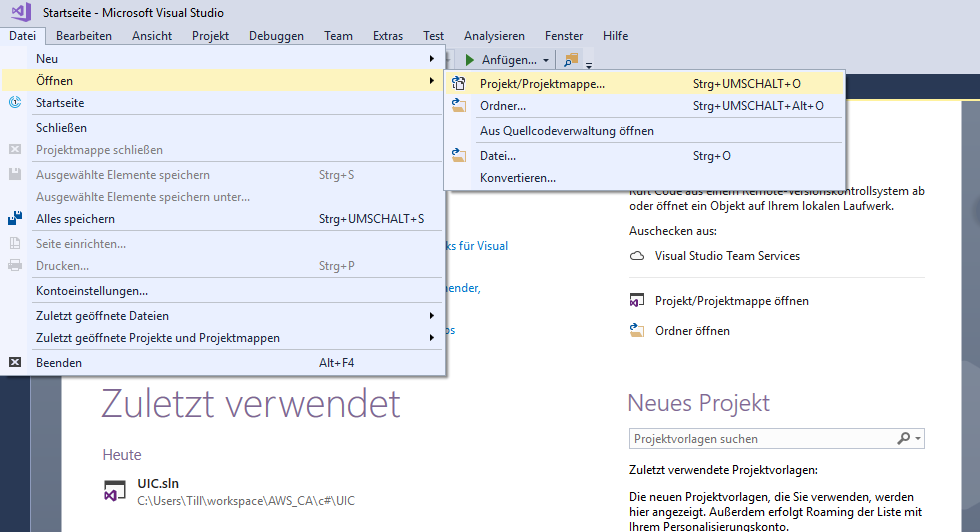
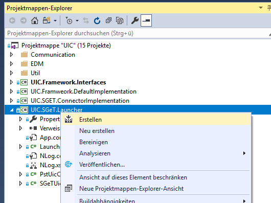

HAW Communication Agent
======================

The repository contains the HAW Communication Agent implementing the functionality of the UIC
to connect to Amazon Webservice. The HAW Communication Agent supports the functionality to send device data  to the AWS
cloud, receive data from it and hand it down to the device, which is able to display the received data.

## Table of content

- [Architecture Overview](#overview)
- [Installation & Setup](#installation)
    - [Recommendations](#recommendations)
    - [HAW Communication Agent](#extension)
    - [UIC AWS Connection Server](#database)
- [License](#license)
- [Links](#links)

## Architecture Overview
The following image shows the architecture of the system, which the HAW Communication Agent was integrated in. AWS currently
doesn't support .NET and therefore is not offering a library, which is able to handle the MQTT-protocol between AWS and
a .NET client. Therefore a Java workaround is used as an interface between the actual HAW CA and AWS, because Java is
supported via libraries by AWS.

The three main parts of the HAW Communication Agent is displayed in the black rectangle of the following image.
These parts are:
- UIC AWS Connection Server
- HAW Communication Agent
- config.properties

## Installation and Setup

The installation of the HAW CA consists of simple steps, which are displayed on the following lines.
Basically you have to setup two enviroments: The Communication Agent and the UIC AWS Connection Server.
Let's first take a look at the recommended software for the installation.

## Recommendations
To guarantee an optimal installation process it is recommended to use the tools, which were used in writing the HAW CA.

The following tools were used:
- [Visual Studio 2017 IDE](https://visualstudio.microsoft.com/vs/)
- [IntelliJ IDE](https://www.jetbrains.com/idea/)
- [Java SE Development Kit 1.8](https://www.java.com/)

### HAW Communication Agent

To open the Communication Agent in the Visual Studio IDE open Visual Studio, click File -> Open -> project map or use CTRL+SHIFT+O.

In the opening dialog navigate in the UIC directory \AWS_CA\c#\UIC.

This should open the project in Visual Studio. On the right side of the IDE you can see the project map
explorer. The following projects are used for the HAW Communication Agent:
- HAW.AWS.CommunicationAgent (The implementation of the CA)
- AWSCommunicationAgent (The interface for the Communication Agent)
- UIC.SGeT.Launcher (The launcher of the communication agents)

To compile the HAW Communication Agent you have to build the UIC.SGeT.Launcher by right-clicking on it in the project explorer and choosing the build option in the context menu.

Visual Studio will now build the launcher, which may take some time. After the building is done you can find the executable in AWS_CA\c#\UIC\UIC.SGeT.Launcher\bin\Debug in your system's explorer.

  

Start the launcher by double-clicking the executable file. An terminal should open and provide information about the activities of the

### UIC AWS Connection Server
